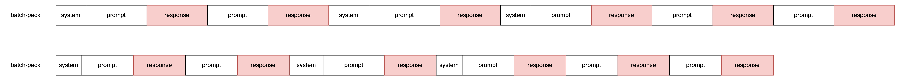

<div align="center">
      <h1>OpenSFT</h1>
</div>
<div align="center">
    <p align="center">
          <em> Open-source / Lightweight / Easy-to-use / Large-Scale / Extra-Long-Text </em>
    </p>
</div>

<hr>

OpenSFT，一个开源的SFT训练框架，基于 accelerator + deepspeed + ring flash attention 实现。

本项目实现了length-pack数据组织逻辑，进一步增加了并行量；实现了序列并行下的分类loss统计，更好地监控各类别效果；新增了序列并行下的turn-loss，兼顾长短对话。

本训练框架非常轻量，易于学习和二次开发，欢迎star。

### 更新

2025.03.27 新增按概率拼接伪多轮，详见data/script/pseudo.multiturn.py


### 环境安装

```bash
git clone https://github.com/mlpod/OpenSFT.git
cd OpenSFT/train
pip install -r requirements.txt
```

### 数据组织方式

SFT中几种不同的数据组织方式：

1. 传统数据组织方式，红色部分是计算损失部分，存在大量padding。


2. 变长、多轮loss数据组织方式，红色部分是计算损失部分，存在padding。


3. 将batch内的序列打包成一个样本，序列并行计算。有padding（需要补齐到能被序列并行度整除），不同样本直接长度差异大。


**本项目实现的数据组织方式**： 在3基础上，将batch内改为按指定最大长度组织数据，打包直到快超出最大长度，因此有更少的padding。不同样本直接长度差异微乎其微。例如指定128K，在distill_r1_110k数据集上可以压缩至1k样本量。

在线打包会带来一定耗时，在此采用了离线计算的方式，将训练和数据处理进行解耦。
另外离线计算中应用了贪心、并发等实现，进一步减少了pack后样本长度差异和时长，详见代码。

数据处理代码放在了data目录中。data目录中的raw目录是存放未预处理的文件，数据格式如下：
```json
{
    "messages": [
        {
            "role": "system",
            "content": ""
        },
        {
            "role": "user",
            "content": ""
        },
        {
            "role": "assistant",
            "content": ""
        }
    ],
    "labels": [0, 0, 1], 
    "meta": {
        "category_id": 1,
        "category_name": ""
    }
}
```
其中 labels 是 messages 中计算损失的轮次，仅 assistant 有效。category_id不为0时，在训练过程中会打印该category_id的loss。

数据配比配置文件格式如下：
```json
{
    "data_name": "",
    "data_path": "",
    "ratio": [
        {
            "category_id": 1,
            "category_name": "",
            "size": 100,
            "sample_rate": 1.0
        },
        {
            "category_id": 2,
            "category_name": "",
            "size": 200,
            "sample_rate": 0.8
        }
    ]
}
```
用户需修改数据预处理逻辑代码 data/step1.preprocess.py，将数据处理成目标格式，并生成数据配比配置文件。
用户可按需修改配比。

脚本中的demo数据：https://huggingface.co/datasets/Congliu/Chinese-DeepSeek-R1-Distill-data-110k/resolve/main/distill_r1_110k.jsonl

详见数据处理脚本
```bash
sh data_process.sh
```

### 训练
```bash
sh train.sh
```
#### category-loss

```json
{
    "epoch": 2,
    "steps": 3,
    "lr": 1.22375e-05,
    "loss": 0.515095591545105,
    "coig/neo_loss": 0.5617072582244873,
    "stem_zh/phy_loss": 0.4811963737010956,
    "EduChat-Math_loss": 0.4951120913028717,
    "meta-math/GSM8K_zh_loss": 0.5640832781791687,
    "exam/coig_exam_loss": 0.6263442635536194,
    "gavinluo/applied_math_loss": 0.4919000566005707,
    "stem_zh/chem_loss": 0.4528641700744629,
    "stem_zh/bio_loss": 0.46091940999031067,
    "zhihu/zhihu_score9.0-10_clean_v10_loss": 0.5875096917152405,
    "xhs/xhs_loss": 0.7661288380622864,
    "stem_zh/med_loss": 0.42540857195854187,
    "human_value/100poison_loss": 0.5484293699264526,
    "ruozhiba/ruozhiba_ruozhiba_loss": 0.825197160243988,
    "logi_qa/logi-qa_loss": 0.6175104975700378,
    "Haijian/Advanced-Math_loss": 0.4288356602191925,
    "exam/kaoyan_loss": 0.6865882873535156
}
```

#### turn-loss
受[SFT loss 计算的那些坑（多轮合并/packing）](https://zhuanlan.zhihu.com/p/721652210)的启发，新增了turn-loss，以兼顾长短对话。细节详见代码，大家可以按需使用。

